  
  

<h1 align="left">Привет! Я — Евгений (sannikofficial) 👋</h1>

  🔬 Data Scientist • 📊 Аналитик • 🤖 AI-инженер • 🌍 Путешественник

<table>
  <tr>
    <td>
      <b>💬 Всегда рад коллаборациям и интересным проектам. Добавляйтесь, форкайте, пишите!</b>
    </td>
  </tr>
</table>

### 🚀 Обо мне
- 🧠 Специализация: AI, Machine Learning, Big Data, Data Science  
- 🛠 Разрабатываю персональные и бизнес-аналитические инструменты  
- 🧾 Веду проекты по анализу навыков, финансов, рынка труда и путешествий  
- 🌐 Личный сайт с инструментами и отчетами: **[sannikofficial.com](https://sannikofficial.com)**

### 📍 Интересные направления
- 📡 Автоматизация аналитики  
- 📊 Визуализация данных  
- 💬 Нейросети и LLM-интерфейсы  
- ✈️ Геоаналитика и тревел-дэшборды  
- 📈 Мониторинг прогресса в навыках и карьере  

---

  
  
  
  
  

### 🛠 Мои инструменты

<table>
  <tr>
    <td><b>🐍 Языки и среды</b></td>
    <td>
      
      
      
    </td>
  </tr>
  <tr>
    <td><b>📊 Data Science & ML</b></td>
    <td>
      
      
      
      
      
      
    </td>
  </tr>
  <tr>
    <td><b>📈 Визуализация</b></td>
    <td>
      
      
      
    </td>
  </tr>
  <tr>
    <td><b>🧱 Базы данных</b></td>
    <td>
      
      
      
    </td>
  </tr>
  <tr>
    <td><b>⚙️ ETL и оркестрация</b></td>
    <td>
      
      
    </td>
  </tr>
  <tr>
    <td><b>☁️ Облака и Big Data</b></td>
    <td>
      
      
      
    </td>
  </tr>
  <tr>
    <td><b>🚀 Деплой и API</b></td>
    <td>
      
      
      
      
    </td>
  </tr>
  <tr>
    <td><b>📦 MLOps</b></td>
    <td>
      
      
      
    </td>
  </tr>
  <tr>
    <td><b>🔮 LLM и AI-интеграции</b></td>
    <td>
      
      
      
    </td>
  </tr>
  <tr>
    <td><b>🛠 AutoML</b></td>
    <td>
      
      
      
    </td>
  </tr>
  <tr>
    <td><b>📚 NLP</b></td>
    <td>
      
      
      
    </td>
  </tr>
  <tr>
    <td><b>🔧 Контроль версий</b></td>
    <td>
      
      
    </td>
  </tr>
</table>

---

### 📈 GitHub Статистика
<table width="100%">
  <tr>
    <td width="50%">
      
      
      
      
    </td>
    <td width="50%">
      
    </td>
  </tr>
</table>

### 📊 График активности

  

---

### 🏆 Достижения GitHub

  

